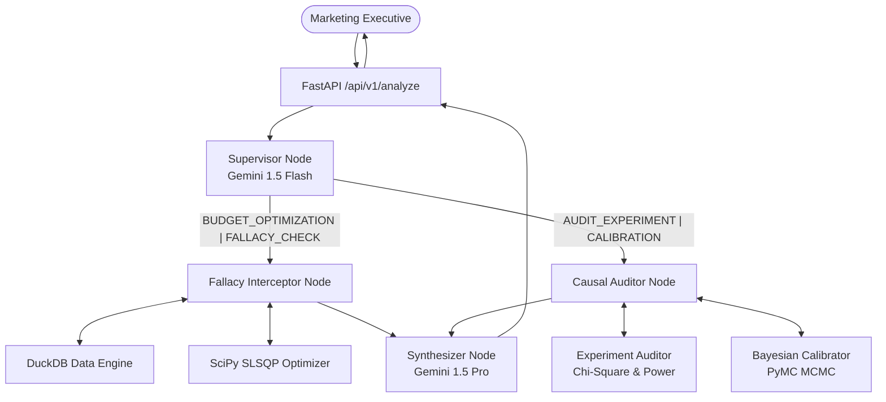

# Marketing Econometrics & Decision Engine (MEDE)

**MEDE** is an enterprise-grade autonomous econometric guardrail and budget allocation platform designed for Tier-1 FMCG marketing leadership.

Built by AI Agents for AI Agents, MEDE enforces **Zero Hallucinated Arithmetic**: LLMs never compute mathematical operations. Instead, LLMs route unstructured intents to deterministic scientific engines and synthesize the rigorous analytical outputs into executive-ready briefs.

## System Architecture



## Mathematical Formulations

### 1. Adstock (Geometric & Weibull)
Advertising decays over time. The deterministic engine applies Geometric and Weibull CDF/PDF transformations over weekly media spend.
* **Geometric:** $x_{\text{adstocked}}(t) = x(t) + \alpha \cdot x_{\text{adstocked}}(t-1)$
* **Weibull CDF:** $F(t; k, \lambda) = 1 - e^{-(t/\lambda)^k}$

### 2. Hill Saturation Curve
Advertising suffers from diminishing returns.
* **Revenue:** $R(S) = \frac{V_{\max} \cdot S^n}{K^n + S^n}$
* **Marginal ROAS:** $\frac{dR}{dS} = \frac{V_{\max} \cdot n \cdot K^n \cdot S^{n-1}}{(K^n + S^n)^2}$

### 3. Non-Linear Budget Optimization
Uses `scipy.optimize.minimize` (SLSQP):
* **Objective:** Maximize total Hill revenue $\min -\sum_i R_i(S_i)$
* **Constraint:** $\sum_i S_i = \text{total\_budget}$

### 4. Experiment Auditing (SRM)
Sample Ratio Mismatch is checked via Pearson's Chi-Square:
* $\chi^2 = \sum \frac{(O_i - E_i)^2}{E_i}$

### 5. Bayesian MMM Prior Calibration
When experimental ground-truth (e.g. GeoLift) is available, PyMC updates the MMM observational prior via MCMC:
```python
with pm.Model() as model:
    beta = pm.Normal("beta", mu=prior_mean, sigma=prior_sd)
    obs = pm.Normal("obs", mu=beta, sigma=lift_se, observed=lift_mean)
```

## Quickstart

### Prerequisites
- Python 3.11+
- `GEMINI_API_KEY`

### Local Execution

```bash
# 1. Install dependencies
pip install -e .[dev]

# 2. Generate Synthetic FMCG Parquet Database
python scripts/generate_synthetic_data.py

# 3. Configure .env
cp .env.example .env
# Edit .env with your GEMINI_API_KEY

# 4. Run the Server
uvicorn src.api.main:app --reload
```

### Docker Execution
```bash
docker-compose -f docker/docker-compose.yml up -d
```

## API Usage Example

**Request:**
```bash
curl -X POST http://localhost:8000/api/v1/analyze \
  -H "Content-Type: application/json" \
  -d '{
    "query": "TV has an average ROAS of 3.5. Let us double the TV budget.",
    "total_budget_eur": 1000000,
    "target_channels": ["TV"]
  }'
```

**Response (Executive Brief):**
```json
{
  "summary_verdict": "CRITICAL RISK: Do not double the TV budget based on average ROAS.",
  "fallacies": [
    {
      "metric": "ROAS",
      "user_assumption": "High Average ROAS implies High Marginal ROAS",
      "mathematical_reality": "TV is highly saturated. Current mROAS is < 1.0.",
      "risk_level": "Critical",
      "capital_at_risk_eur": 500000
    }
  ],
  "recommended_allocations": [],
  "methodology_caveats": ["Assumes static market conditions."]
}
```

## Evaluation Suite
Run the rigorous prompt evaluation pipeline (requires LLM access):
```bash
python evaluations/run_evals.py
```
